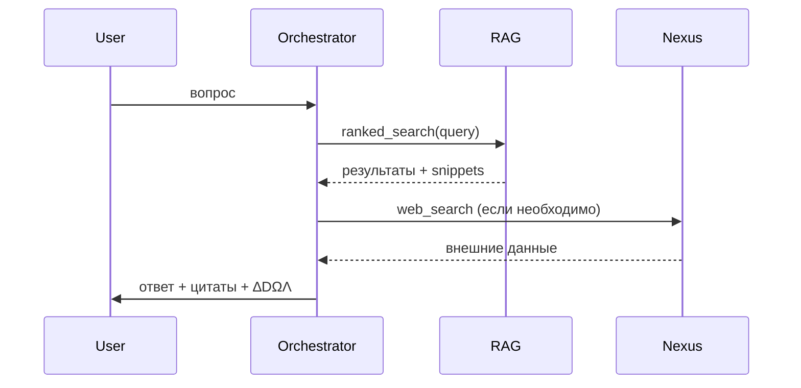

# Retrieval-Augmented Generation (RAG) Искры

## Архитектура

1. **Индексирование проекта.** При запуске `RAGSystem.build_index()` сканирует файлы, указанные в `DIST_MANIFEST.json`, и создаёт обратный индекс по ключевым словам.
2. **Ранжирование.** `ranked_search(query, limit=5)` возвращает список `(score, path, snippet)`, упорядоченных по релевантности и свежести.
3. **Экстракция.** `extract(path, query)` берёт контекст вокруг совпадения (±200 символов) и маркирует его для цитирования.
4. **Внешние источники.** Через IskraNexus подключаются web_search/web_fetch, но только после разрешения оператора.

## Поток запроса



## Настройка и команды

- Прогоните скрипт для построения индекса: `python - <<'PY'` с вызовом `panel.add_document(...)` для основных файлов и `panel.search("канон")`.
- Проверить поисковый сигнал можно через интерактивный пример:

  ```bash
  python - <<'PY'
  from SpaceCoreIskra_vOmega.modules import rag_panel
  panel = rag_panel.RAGPanel()
  panel.add_document("README", open("README.md", encoding="utf-8").read(), keywords=["искра", "канон"])
  for doc in panel.search("канон"):
      print(doc.title, doc.score, doc.source)
  PY
  ```
- В режиме CI достаточно запускать `pytest tests/test_spacecore_modules.py::test_rag_ranked_search`.

## Приоритет источников

1. **Project-first.** Файлы из репозитория, особенно `docs/`, `schemas/`, `MANIFEST_*`.
2. **Официальные внешние источники.** Сайты стандартов, документация библиотек.
3. **Обзоры и СМИ.** Только для контекста, обязательно проверять даты.
4. **Пользовательские заметки.** Не хранятся долговременно, поэтому требуют подтверждения.

## Требования к цитированию

- Каждая цитата из RAG должна сопровождаться ссылкой на путь файла или URL.
- Для внешних источников указывайте дату доступа.
- При использовании нескольких фрагментов из одного файла комбинируйте их в таблицу различий.

## Расширение RAG

Добавляя новый источник:

1. Укажите путь/коннектор в `IskraNexus-v1/connector_registry.json`.
2. Добавьте тест, который проверяет, что источник возвращает данные без ошибок.
3. Обновите данный документ и README, описав приоритет источника и ограничения.
4. Включите домен в allowlist (если требуется сеть).
