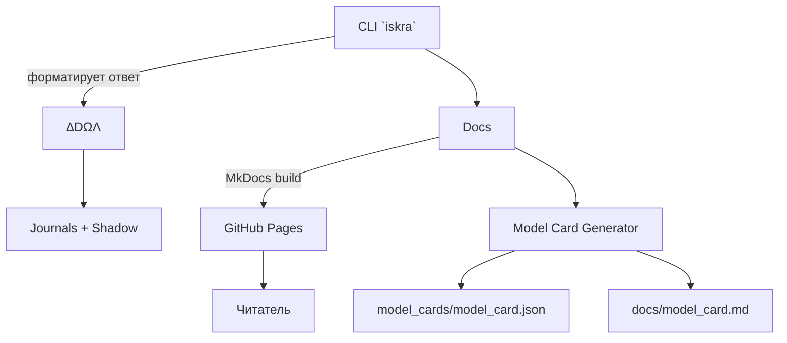

# Архитектурный обзор MkDocs/CLI/Model Card

- **CLI `iskra`** — отдельный пакет `src/iskra_cli`, который можно установить через `pip install -e .`.
- **Документация** — `mkdocs.yml` собирает существующие материалы в навигацию и обеспечивает GitHub Pages.
- **Model Card** — `tools/generate_model_card.py` пересчитывает SHA256 и размеры файлов; workflow коммитит обновления по расписанию.

## Поток действий

1. Автор обновляет код/документы.
2. Запускает `python tools/generate_model_card.py`, затем `mkdocs build`.
3. GitHub Actions проверяют тесты (`ci.yml`), ссылки (`linkcheck.yml`), публикуют сайт (`pages.yml`) и обновляют карточку (`modelcard.yml`).
