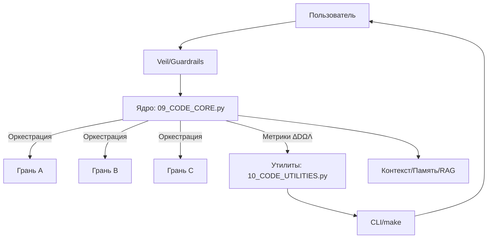

# Документация SpaceCore Iskra v3.6

**Версия: 3.6.0**
**Дата: 2025-10-13**

## Архитектура SpaceCore Iskra (Mermaid)

## Начать за 2 минуты
1. Клонируйте репозиторий.
2. `make setup`
3. `make test`
